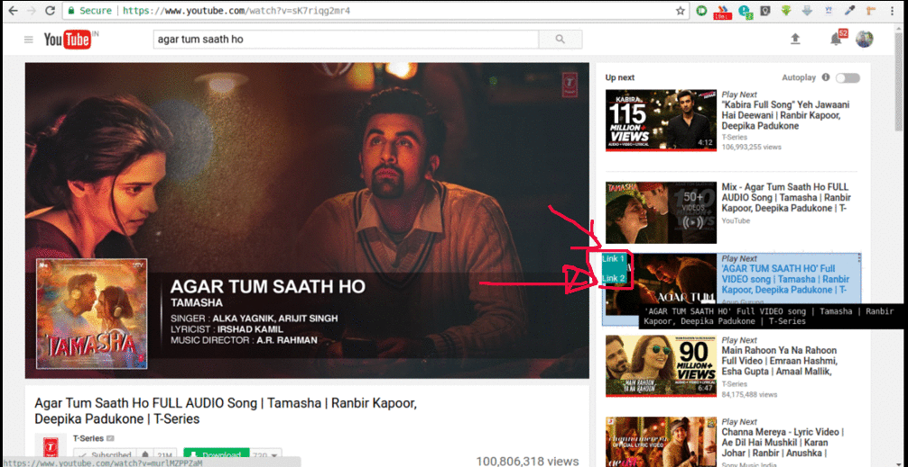

# Play Next
Play Next in YouTube - Chrome Extension

Things added:

* A blue box that shows which video has been selected. That is added via `crx_mouse_visited` class in inject.css.
* The bubble will show up on the top left corner of an thumbnail when hovered. As suggested, it contains 2 links, which is controlled via `mousemove` documentListener in inject.js.
* Stackoverflow answers linked. The hover bubble is kept simple for now. Additional work can be done via this [bubble css file](http://nicolasgallagher.com/pure-css-speech-bubbles/demo/).
* Adding a screenshot below.

